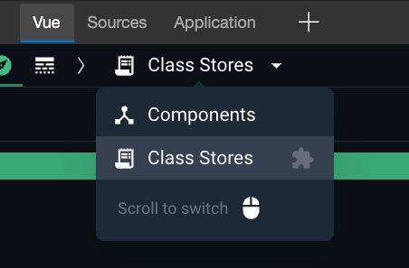
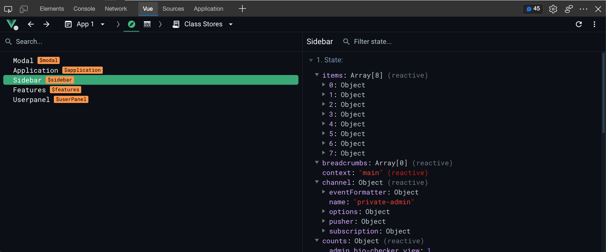

# Vue Class Stores - Dev Tools Plugin

### Usage:

```shell
npm install class-stores-plugin
yarn add class-stores-plugin
```

```javascript
import Vue               from 'vue';
import ClassStoresPlugin from 'class-stores-plugin';

Vue.use(ClassStoresPlugin);

const app = new Vue({}).$mount(document.getElementById('app'));
```

I had some scenarios where the above doesn't work, if this is the case, you can do it this way:

```javascript
import Vue             from 'vue';
import {setupDevtools} from 'class-stores-plugin';

const app = new Vue({}).$mount(document.getElementById('app'));

setupDevtools(app);
```

## Viewing Class Stores
In vue devtools, click the dropdown and select "Class Stores"



Select your class store, and you can now see your state, methods & getters :)

